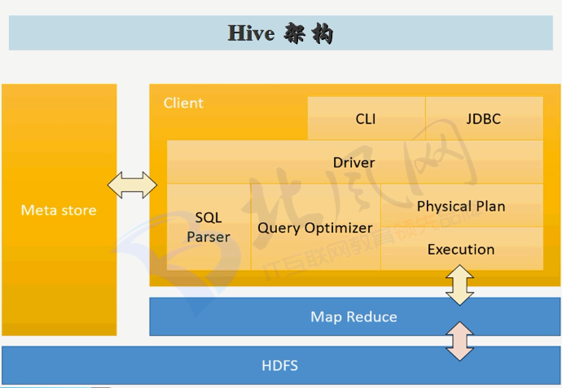

# 1. Hive 概述

>  Hive是建立在hadoop上的数据仓库基础架构。它提供了一系列的工具，可以用来进行数据**提取**、 **转化**、**加载**（**ETL** : extract   transform   load），这是一种可以存储、查询和分析存储在Hadoop中的大规模数据的机制。Hive定义了简单的类SQL查询语言，成为QL，它运行熟悉SQL的用户查询数据。同时，这个语言也允许熟悉MapReduce开发者的开发自定义的mapper和reducer来处理内建的mapper和reducer无法完成的复杂的分析工作。
>
>  - 数据存储在HDFS上 (Hive的表其实就是HDFS的目录/文件夹，按表名把文件夹分开。如果是分区表，则分区是子文件夹，可以直接在M/R Job里使用这些数据)
>  - 执行程序运行在YARN上
>  - 分析数据底层的实现是MapReduce (Hive是SQL解析引擎，它将SQL语句转译成 M/R Job 然后再Hadoop执行)
>

- Hive用户接口主要有三个:

> 1、CLI， 即Shell命令行
>
> 2、JDBC/ODBC
>
> 3、WebGUI是通过浏览器访问的

- Hive将元数据存储在数据库中，目前只支持Mysql、derby。Hive中的元数据包括表的名字，表的列和分区及其属性，表的属性（是否为外部表等），表的数据所在目录等。
- 解释器、编译器、优化器完成HQL查询语句从词法分析、语法分析、编译、优化以及查询计划的生成。生成的查询计划存储在HDFS中，并在随后的MapReduce调用执行。
- Hive 的数据存储在HDFS中，大部分的查询由MapReduce完成（包含*的查询，比如: select * from table不会生成MapReduce任务）



- **驱动器**  Driver:

- **解析器**：将SQL字符串转换成抽象语法书AST，这一步一般都用第三方工具库完成，比如antlr； 对AST进行语法分析，比如表是否存在、字段是否存在、SQL语义是否有误（比如select中被判定为聚合的字段在group by中是否有出现）；

- **编译器**：将AST变成生成逻辑执行计划；

- **优化器**：对逻辑执行计划进行优化；

- **执行器**：把逻辑执行计划转换成可以运行的物理计划。对于Hive来说，就是MR/TEZ/Spark

# 2. Hive 命令行

## 2.1. Hive CLI  环境变量和属性

> Hive CLI 中的变量和属性命名空间

<table border='2'>
    <tr>
        <th width='90'>命名空间</th>
        <th width='120'>使用权限</th>
        <th>描述</th>
        <th width='420'>设置和修改方式</th>
    </tr>
    <tr>
        <td>hivevar</td>
        <td>可读/可写</td>
        <td>用户自定义变量</td>
        <td> 在 Linux Shell 中通过下面三种方式：</br>./hive -d key=value </br> ./hive --define key=value </br> ./hive --hivevar key=value </td>
    </tr>
    <tr>
        <td>hiveconf</td>
        <td>可读/可写</td>
        <td>Hive 相关的配置属性 </br>（配置文件中配置的属性，可在 HIVE_HOME/conf/hivedefault.xml.template 中查看所有配置属性和默认值）</td>
        <td> 在 Linux Shell 中通过下面一种方式：</br>
            ./hive --hiveconf property=value 
        </td>
    </tr>
    <tr>
        <td>system</td>
        <td>可读/可写</td>
        <td>Java定义的配置属性</td>
        <td></td>
    </tr>
    <tr>
        <td>env</td>
        <td>只可读</td>
        <td>Linux Shell环境定义的环境变量</td>
        <td></td>
    </tr>
</table>


> 在 Hive CLI 中可以通过 Set 命令设置和查看所有变量和属性：

```shell
hive> set;   # 输出所有变量和属性(包含四个命名空间中的)
hive> set system:user.name; # 输出指定变量和属性
hive> set -v;  # 输出更多信息，包含 Hadoop 所定义的所有属性
hive> set varname=varvalue; # 设置变量值
```

## 2.2. Hive CLI 的 Linux Shell

1. ./hive 后面可以跟的参数，可以通过 ./hive --help 查看，结果如下：

```shell
[root@hadoop01 hive]# ./hive --help
Usage ./hive <parameters> --service serviceName <service parameters>
Service List: beeline cli help hiveserver2 hiveserver hwi jar lineage metastore metatool orcfiledump rcfilecat schemaTool version 
Parameters parsed:
  --auxpath : Auxillary jars 
  --config : Hive configuration directory
  --service : Starts specific service/component. cli is default
Parameters used:
  HADOOP_HOME or HADOOP_PREFIX : Hadoop install directory
  HIVE_OPT : Hive options
For help on a particular service:
  ./hive --service serviceName --help
Debug help:  ./hive --debug --help
```

> ./hive 后面可以跟下面的参数中的一个，默认是 cli，进入hive cli 模式，即 Hive 的命令行

```shell
beeline cli help hiveserver2 hiveserver hwi jar lineage metastore metatool orcfiledump rcfilecat schemaTool version
```

2. ./hive --serice cli 或者 ./hive 后面跟的参数，可以通过下面语句查看。

```shell
[root@hadoop01 hive]# ./hive --help --service cli
usage: hive
 -d,--define <key=value>          Variable subsitution to apply to hive
                                  commands. e.g. -d A=B or --define A=B
    --database <databasename>     Specify the database to use
 -e <quoted-query-string>         SQL from command line
 -f <filename>                    SQL from files
 -H,--help                        Print help information
 -h <hostname>                    connecting to Hive Server on remote host
    --hiveconf <property=value>   Use value for given property
    --hivevar <key=value>         Variable subsitution to apply to hive
                                  commands. e.g. --hivevar A=B
 -i <filename>                    Initialization SQL file
 -p <port>                        connecting to Hive Server on port number
 -S,--silent                      Silent mode in interactive shell
 -v,--verbose                     Verbose mode (echo executed SQL to the
                                  console)
```

> 重要参数说明

<table border="2">
    <tr>
        <th width='230'>参数</th>
        <th>说明</th>
    </tr>
    <tr>
        <td>-d,--define <key=value></br>
        --hivevar <key=value></br>
        --hiveconf <property=value></br>
        </td>
        <td>在命令行定义用户的自定义变量，以便在Hive脚本中使用这些变量，Hive会将这些键值对放到对应的命名空间（hivevar、hiveconf、system、env），-d 和 --hivevar 设置的变量都在命名空间 hivevar 中，--hiveconf 则在命名空间 hiveconf 中</td>
    </tr>
    <tr>
        <td>-e <quoted-query-string></td>
        <td>执行“一次使用”命令。执行一个或者多个查询，执行结束后 hive CLI立即退出的情况。</td>
    </tr>
    <tr>
        <td> -f <filename></td>
        <td>执行指定文件中的一个或者多个查询语句，一般为 .q 或者 .hql 后缀的文件。如果已经进入了 Hive CLI，则可以使用 source finame.hql 来完成同样的操作。</td>
    </tr>
    <tr>
        <td>-i <filename></td>
        <td>允许用户指定一个文件，当 Hive CLI 启动时，在提示符出现前会执行这个文件。Hive 默认会在HOME目录下寻找名为 .hiverc 的文件，而且会自动执行这个文件中的命令（如果文件存在的话）。 需求：对于需要频繁执行的命令，例如设置系统属性，或者增加对于Hadoop的分布式内存进行自定义的Hive扩展的Jar包。</td>
    </tr>
    <tr>
        <td>-S</td>
        <td>开启静默模式，和其他参数联用，可以在输出结果中去掉“OK”和“Time taken”等信息。</td>
    </tr>
</table>

## 2.3. Hive CLI 的其他功能

1. 在 Hive CLI 中执行简单的 Linux bash shell，需要加上 ！

```shell
hive> ! pwd;
hive> ! ls;
```

2. 在 Hive CLI 中执行 Hadoop 的 dfs 命令

```shell
hive> dfs ls / ;
```

3. Hive 脚本注释, 用 -- 表示注释

```shell
-- This is the best hive script evar !
SELECT * FROM sutdent_table;
```

4. 可以在 Linux Shell 中结合 grep 模糊查询变量:

```shell
[root@hadoop01 bin]# ./hive -S -e 'set;' | grep warehouse
hive.metastore.warehouse.dir=/user/hive/warehouse
hive.warehouse.subdir.inherit.perms=false
```

# 3. 数据类型和文件格式

## 3.1. [数据类型](https://cwiki.apache.org/confluence/display/Hive/LanguageManual+Types)

### 3.1.1 基础数据类型

<table>
    <tr><th>数据类型</th><th>长度</th></tr>
    <tr><td>TINYINT</td><td>1 byte</td></tr>
    <tr><td>SMALLINT</td><td>2 byte</td></tr>
    <tr><td>INT</td><td>4 byte</td></tr>
    <tr><td>BIGINT</td><td>8 byte</td></tr>
    <tr><td>BOOLEAN</td><td>TRUE / FALSE</td></tr>
    <tr><td>FLOAT</td><td>单精度浮点数</td></tr>
    <tr><td>DOUBLE</td><td>双精度浮点数</td></tr>
    <tr><td>DECIMAL</td><td>用户自定义大小和精度的定点值</td></tr>
    <tr><td>STRING</td><td>指定字符集的字符序列。</td></tr>
    <tr><td>VARCHAR</td><td>指定字符集的变长字符序列，并设置了最大长度</td></tr>
    <tr><td>CHAR</td><td>指定字符集的定长字符序列，并设置了固定长度</td></tr>
    <tr><td>TIMESTAMP</td><td>时间，精确到纳秒</td></tr>
    <tr><td>DATE</td><td>日期</td></tr>
    <tr><td>BINARY</td><td>字节数组</td></tr>
</table>

### 3.1.2 复杂数据类型
<table>
    <tr><th width='100'>数据类型</th><th>描述</th><th width='200'>示例</th></tr>
    <tr><td>STRUCT</td><td>结构体，使用 . 来访问具体的部分</td><td>例如 S.name</td></tr>
    <tr><td>MAP</td><td>键值对元组，通过 ['key'] 获取到对应的 'value'。 </td><td>例如 M['name']</td></tr>
    <tr><td>ARRAY</td><td>数组，每个元素必须是同一个类型，需要通过 [n] 来访问具体元素，下表从 0 开始。</td><td> 例如A数组是：['a', 'b', 'c']，A[1]返回 'b'。 </td></tr>
</table>

## 3.2. 内置运算符和函数

### 3.2.1 内置运算符

- 关系运算符
    - = 、!= 、>、>=、<、<=
    - A IS NULL、A IS NOT NULL
    - A LIKE B：类似  MYSQL 中的 LIKE 语句，例如： 'foobar' LIKE 'foo%'， 或者 'foobar' LIKE 'foo__' 返回值都为 True
    - A RLIKE B：正则表达式
    - A REGEXP B : 和 RLIKE 类似
- 算数运算符
    - +、 -、 *、 /、 %、 &、 |、 ^、 ~
- 逻辑运算符
    - AND(&&)、OR(||)、NOT(!)
- 复杂数据类型运算符
    - Array[n]、Map[key]、Struct.x


### 3.2.2 内置函数

<table>
    <tr><th width='90'>返回类型</th><th>函数签名</th><th>描述</th></tr>
    <tr><td>string</td><td>from_unixtime(int unixtime)</td><td>输入一个 unix形式的时间整数，返回 “yyyy-MM-dd HH:mm:ss” 格式的字符串</td></tr>
    <tr><td>type类型</td><td>cast(<expr> as type)</td><td>将一个表达式的值转换为对应类型，例如 cast("1" as int)，将 string 类型的 “1” 转为 int 型的 1</td></tr>
    <tr><td>string</td><td>get_json_object(string json_string, string path)</td><td>从json字符串中提取json对象</td></tr>
    <tr><td>string</td><td>to_date(string timestamp)</td><td>将“yyyy-MM-dd HH:mm:ss”格式转为“yyyy-MM-dd”格式</td></tr>
    <tr><td>int</td><td>day(string date)</td><td>day("1970-11-01") = 1</td></tr>
    <tr><td>int</td><td>month(string date)</td><td>month("1970-11-01")=11</td></tr>
    <tr><td>int</td><td>year(string date)</td><td>year("1970-11-01")=1970</td></tr>
    <tr><td>double</td><td>rand(int seed)</td><td>返回一个随机数</td></tr>
    <tr><td>bigint</td><td>floor(double a)</td><td>返回一个不大于a的最大整数，a向下取整</td></tr>
    <tr><td>bigint</td><td>ceil(double a)</td><td>返回一个不小于a的最小整数，a向上取整</td></tr>
    <tr><td>int</td><td>size(Array<T>)</td><td>数组大小</td></tr>
    <tr><td>int</td><td>size(Map<T>)</td><td>Map的大小</td></tr>
    <tr><td>bigint</td><td>round(double a)</td><td>将a转换为整数的值</td></tr>
    <tr><td>string</td><td>concat(string A, string B, ....)</td><td>按参数顺序连接两个或者多个字符串</td></tr>
    <tr><td>string</td><td>upper(string a)</br>ucase(string a)</td><td>将a的所有字符转换成大写</td></tr>
    <tr><td>string</td><td>lower(string a)</br>lcase(string a)</td><td>将a的所有字符转换成小写</td></tr>
    <tr><td>string</td><td>regexp_replace(string a, string b, string c)</td><td>Java的正则表达式替换</td></tr>
    <tr><td>string</td><td>trim(string a) </br> ltrim(string a)</br>rtrim(string a)</td><td>去除a的空格</td></tr>
    <tr><td>string</td><td>substring(string a, int start, int end)</td><td>截取字符串</td></tr>
</table>

> 集成函数

<table>
    <tr><th width='90'>返回类型</th><th width="150">函数签名</th><th>描述</th></tr>
    <tr><td>bigint</td><td>count(*)</br>count(expr)</br>count(DISTINCT expr)</td><td>返回总行数</td></tr>
    <tr><td>double</td><td>sum(col)</br>count(DISTINCT col)</td><td>返回列的总和</td></tr>
    <tr><td>double</td><td>avg(col)</br>avg(DISTINCT col)</td><td>返回列的均值</td></tr>
    <tr><td>double</td><td>min(col)</td><td>返回列的最小值</td></tr>
    <tr><td>double</td><td>max(col)</td><td>返回列的最大值</td></tr>
</table>


- **注**：  在 Hive CLI 中使用下面命令查看函数信息

```
show functions;
describe function <function_name>;
describe function extended <function_name>;
```

## 3.3. 文件格式

- Avro 文件
- ORC 文件
- Parquet 文件
- Compressed Data Storage 文件
- LZO 压缩文件

# 4. 数据定义语言 DDL

## 4.1. Hive DDL 综述

[Hive 数据定义语句 DDL](https://cwiki.apache.org/confluence/display/Hive/LanguageManual+DDL)

- DDL 包含下面几个功能：
    -  **Create**: database/schema, table, view, function, index
    -  **Drop**: database/schema, table, view, index
    -  **Alter**: database/schema, table, view
    -  **Show**: databases/schemas, tables, views, partitions, funcations, indexes, columns
    -  **Describe**: database/schema, table_name, view_name

## 4.2. Create/Drop/Alter/Use Database

- **Create Database**

> **DATABASE** 和 **SCHEMA** 表示一个意思，可以互换。

-  **数据库一旦创建，名称是不可更改的**。

> **LOCATION** 是数据库存储位置，默认路径为 **hive.metastore.warehouse.dir**

```
CREATE (DATABASE|SCHEMA) [IF NOT EXISTS] database_name
  [COMMENT database_comment]
  [LOCATION hdfs_path]
  [WITH DBPROPERTIES (property_name=property_value, ...)];
```

- **Drop Database**

> **RESTRICT** : 如果 database 有 tables，则drop失败；**CASCADE** : 如果 database 有 tables，则drop掉所有 tables, 然后再 drop 当前 database。

> 默认是 **RESTRICT**

```
DROP (DATABASE|SCHEMA) [IF EXISTS] database_name [RESTRICT|CASCADE];
```

- **Alter Database**

> 修改 **LOCATION** 之后，之前已有的 tables 等数据并不会移动到新的目录，但之后添加的tables会在新目录下。

```
ALTER (DATABASE|SCHEMA) database_name SET DBPROPERTIES (property_name=property_value, ...);   -- (Note: SCHEMA added in Hive 0.14.0)
ALTER (DATABASE|SCHEMA) database_name SET OWNER [USER|ROLE] user_or_role;   -- (Note: Hive 0.13.0 and later; SCHEMA added in Hive 0.14.0)
ALTER (DATABASE|SCHEMA) database_name SET LOCATION hdfs_path; -- (Note: Hive 2.2.1, 2.4.0 and later)
```

- **Use Database**

> 之后所有的 Hive Sql 都默认对 use 所设定的 database 进行操作。

```
USE database_name;
USE DEFAULT;
```

> 对 database 的增删改查：Create/Drop/Alter/Show+Describe/Use

## 4.3. Create/Drop/Truncate Table

### 4.3.1 Create Table

```
CREATE [TEMPORARY] [EXTERNAL] TABLE [IF NOT EXISTS] [db_name.]table_name    -- (Note: TEMPORARY available in Hive 0.14.0 and later)
  [(col_name data_type [COMMENT col_comment], ... [constraint_specification])]
  [COMMENT table_comment]
  [PARTITIONED BY (col_name data_type [COMMENT col_comment], ...)]
  [CLUSTERED BY (col_name, col_name, ...) [SORTED BY (col_name [ASC|DESC], ...)] INTO num_buckets BUCKETS]
  [SKEWED BY (col_name, col_name, ...)                  -- (Note: Available in Hive 0.10.0 and later)]
     ON ((col_value, col_value, ...), (col_value, col_value, ...), ...)
     [STORED AS DIRECTORIES]
  [
   [ROW FORMAT row_format] 
   [STORED AS file_format]
     | STORED BY 'storage.handler.class.name' [WITH SERDEPROPERTIES (...)]  -- (Note: Available in Hive 0.6.0 and later)
  ]
  [LOCATION hdfs_path]
  [TBLPROPERTIES (property_name=property_value, ...)]   -- (Note: Available in Hive 0.6.0 and later)
  [AS select_statement];   -- (Note: Available in Hive 0.5.0 and later; not supported for external tables)
 //
CREATE [TEMPORARY] [EXTERNAL] TABLE [IF NOT EXISTS] [db_name.]table_name
  LIKE existing_table_or_view_name
  [LOCATION hdfs_path];
 //
data_type
  : primitive_type
  | array_type
  | map_type
  | struct_type
  | union_type  -- (Note: Available in Hive 0.7.0 and later)
 //
primitive_type
  : TINYINT
  | SMALLINT
  | INT
  | BIGINT
  | BOOLEAN
  | FLOAT
  | DOUBLE
  | DOUBLE PRECISION -- (Note: Available in Hive 2.2.0 and later)
  | STRING
  | BINARY      -- (Note: Available in Hive 0.8.0 and later)
  | TIMESTAMP   -- (Note: Available in Hive 0.8.0 and later)
  | DECIMAL     -- (Note: Available in Hive 0.11.0 and later)
  | DECIMAL(precision, scale)  -- (Note: Available in Hive 0.13.0 and later)
  | DATE        -- (Note: Available in Hive 0.12.0 and later)
  | VARCHAR     -- (Note: Available in Hive 0.12.0 and later)
  | CHAR        -- (Note: Available in Hive 0.13.0 and later)
 //
array_type
  : ARRAY < data_type >
 //
map_type
  : MAP < primitive_type, data_type >
 //
struct_type
  : STRUCT < col_name : data_type [COMMENT col_comment], ...>
 //
union_type
   : UNIONTYPE < data_type, data_type, ... >  -- (Note: Available in Hive 0.7.0 and later)
 //
row_format
  : DELIMITED [FIELDS TERMINATED BY char [ESCAPED BY char]] [COLLECTION ITEMS TERMINATED BY char]
        [MAP KEYS TERMINATED BY char] [LINES TERMINATED BY char]
        [NULL DEFINED AS char]   -- (Note: Available in Hive 0.13 and later)
  | SERDE serde_name [WITH SERDEPROPERTIES (property_name=property_value, property_name=property_value, ...)]
 //
file_format:
  : SEQUENCEFILE
  | TEXTFILE    -- (Default, depending on hive.default.fileformat configuration)
  | RCFILE      -- (Note: Available in Hive 0.6.0 and later)
  | ORC         -- (Note: Available in Hive 0.11.0 and later)
  | PARQUET     -- (Note: Available in Hive 0.13.0 and later)
  | AVRO        -- (Note: Available in Hive 0.14.0 and later)
  | JSONFILE    -- (Note: Available in Hive 4.0.0 and later)
  | INPUTFORMAT input_format_classname OUTPUTFORMAT output_format_classname
 //
constraint_specification:
  : [, PRIMARY KEY (col_name, ...) DISABLE NOVALIDATE ]
    [, CONSTRAINT constraint_name FOREIGN KEY (col_name, ...) REFERENCES table_name(col_name, ...) DISABLE NOVALIDATE 
```

- Table 和 Column 的名称是不区分大小写的。
- Table 和 Column 的 **COMMENT** 是字符串，并且需要单引号引用起来。
- 如果不写 **EXTERNAL** 语句，则被称为 managed table，可以通过 `describe extended table_name;` 来查看一个 table 是 external table 还是 managed table。
- 通过 **TBLPROPERTIES** 设置 Table 的一些属性。

#### 4.3.1.1 **Managed Table 和 External Table**

>  **Managed Table** (默认) ：文件、元数据、统计信息由内部的 Hive 进程进行管理，默认存储在 `hive.metastore.warehouse.dir` 路径中，如果 drop managed table, 这个 table 中的所有数据和元数据都会被删除；
>
> **External Table**: 数据和元数据都保存在外部文件中，并且可以被Hive的外部进程读取和管理，当 drop 这个 table 时，实体文件不会被删除。

> - 当需要 Hive 管理 Table的整个生命周期或需要一个临时 Table的时候，使用 Managed Table。
>
> - 当文件已经存在的时候需要使用 External Table。

- **EXTERNAL 需要结合 LOCATION 使用**，指定要指向的文件位置，如果不指定，则还会在 默认路径 `hive.metastore.warehouse.dir` 下。

#### 4.3.1.2  **Storage Formats**: STORED AS file_format

- **STORED AS 主要是读取一个文件并解析成多条记录，或者是将多条记录合并然后写入一个文件**

> Hive 支持内置文件格式和用户自定义文件格式来存储 Table 的数据。内置文件格式包括：`textfile`(默认存储格式)、`sequencefile`(压缩的序列文件)、`orc`、`parquet`、`avro`、`rcfile`、`jsonfile`等格式。

> 下面两块代码的效果是一样的，也可以使用第二种方式，指定自定义的存储格式(首先需要实现两个Java类)

```
STORED AS TEXTFILE
```

```
STORED AS
INPUTFORMAT 'org.apache.hadoop.mapred.TextInputFormat'
OUTPUTFORMAT 'org.apache.hadoop.mapred.TextOutputFormat' 
```


#### 4.3.1.3  **Row Formats & SerDe**: ROW FORMAT row_format

- **ROW FORMAT 主要是将每一条记录解析成多列，或者将多列序列化成一条记录**

> 每一行的格式，也就是一行记录中，各个字段是如何分割的。row_format 分两种情况：

1. `ROW FORMAT DELIMITED`  指定简单的分隔符
```
DELIMITED [FIELDS TERMINATED BY char [ESCAPED BY char]] [COLLECTION ITEMS TERMINATED BY char]
        [MAP KEYS TERMINATED BY char] [LINES TERMINATED BY char]
        [NULL DEFINED AS char]
```

2. `ROW FORMAT SERDE` 指定一个Java类去解析，可面向复杂的分割，内置的有三种类：`org.apache.hadoop.hive.serde2.RegexSerDe` 通过正则表达式去解析；`org.apache.hive.hcatalog.data.JsonSerDe` ：解析Json； `org.apache.hadoop.hive.serde2.OpenCSVSerde` 解析 CSV/TSV。也可以自定义解析类。

```
 SERDE serde_name [WITH SERDEPROPERTIES (property_name=property_value, property_name=property_value, ...)]
```

- `WITH SERDEPROPERTIES` 语句是给 SERDE 指定的解析类传递参数。


#### 4.3.1.4  **Partitioned Tables**: PARTITIONED BY

> 一个 Table 可以根据一个或者多个 column 进行分区，Hive 会根据分区column的每一个值创建一个独立的目录来存储数据。例如:

```
create table table_name (
  id                int,
  dtDontQuery       string,
  name              string
)
partitioned by (date string)
```

> 存储的时候，每个日期会生成一个独立的目录，但在查询的时候，where 语句后面依然可以使用 where date=... 相当于这个表依然还是四个字段。


#### 4.3.1.5 **Create Table As Select (CTAS)**

> 使用SELECT语句查询的结果构建一个Table, CTAS 后面可以是任意的 HiveSQL，但具有以下限制：

1. 所要创建table不能是 partitioned table
2. 所要创建table不能是 external table
3. 所要创建table不能是 list bucketing table

#### 4.3.1.6 **Create Table Like**

> `LIKE` 语句用于拷贝一个现有的 Table 的定义创建一个 Table, 并且不会拷贝数据。

#### 4.3.1.7 **Bucketed Sorted Tables**

> 将数据分块，结合 `CLUSTER BY` 和 `SORTED BY` 语句结合使用，这两个语句不会影响写过程，而是会影响读过程。所以，用户必须小心地通过指定reducers的数量等于分块的数量，并在查询语句中正确使用 `CLUSTER BY`和`SORT BY`命令。(MapReduce 的分区)

```
CREATE TABLE page_view(viewTime INT, userid BIGINT,
     page_url STRING, referrer_url STRING,
     ip STRING COMMENT 'IP Address of the User')
 COMMENT 'This is the page view table'
 PARTITIONED BY(dt STRING, country STRING)
 CLUSTERED BY(userid) SORTED BY(viewTime) INTO 32 BUCKETS
 ROW FORMAT DELIMITED
   FIELDS TERMINATED BY '\001'
   COLLECTION ITEMS TERMINATED BY '\002'
   MAP KEYS TERMINATED BY '\003'
 STORED AS SEQUENCEFILE;
```

> 上面的语句的含义是：根据 userid 字段划分成32个分块，每个分块内按照 viewTime 字段排序。

#### 4.3.1.8 **Skewed Tables**

> 此功能可用于提高一个或多个列具有偏斜值的表的性能。一些列的值可能会很多，但是Hive会自动将这些文件拆分为单独的文件（或列表存储的情况下的目录）。

```
CREATE TABLE list_bucket_single (key STRING, value STRING)
  SKEWED BY (key) ON (1,5,6) [STORED AS DIRECTORIES];
```

#### 4.3.1.9 **Temporary Tables**

> 只有在当次会话中可见的Table,数据将存储在用户的暂存目录中，并在会话结束时删除。 Temporary Table 有两个限制：

1. 不支持 Partition 列
2. 不支持创建 index

```
CREATE TEMPORARY TABLE list_bucket_multiple (col1 STRING, col2 int, col3 STRING);
```

#### 4.3.1.10 **Transactional Tables**

#### 4.3.1.11 **Constraints**

> 对**未经验证的主键和外键**的支持，当存在主键外键约束时，会提升查询性能。

```
create table pk(id1 integer, id2 integer,
  primary key(id1, id2) disable novalidate);
  //
create table fk(id1 integer, id2 integer,
  constraint c1 foreign key(id1, id2) references pk(id2, id1) disable novalidate);
```


### 4.3.2 Drop Table

> 删除一个 Table 

```
DROP TABLE [IF EXISTS] table_name [PURGE];     -- (Note: PURGE available in Hive 0.14.0 and later)
```

> 可以设置 fs.trash.interval ，开启回收站功能。


### 4.3.3 Truncate Table

> 删除一个 Table 中的所有行，只能对 managed table 操作。在删除的时候可以指定 分区

```
TRUNCATE TABLE table_name [PARTITION partition_spec];
 
partition_spec:
  : (partition_column = partition_col_value, partition_column = partition_col_value, ...)
```


## 4.4. Alter Table/Partition/Column

### 4.4.1 Alter Table

- **修改表只会修改表元数据，表数据本身不会有任何修改。**

#### 4.4.1.1 Rename Table

> `RENAME TO`

```
ALTER TABLE table_name RENAME TO new_table_name;
```

#### 4.4.1.2 Alter Table Properties

> `SET TBLPROPERTIES`, 可以用来修改 Table 的 comment之类的属性。

```
ALTER TABLE table_name SET TBLPROPERTIES table_properties;
table_properties:
  : (property_name = property_value, property_name = property_value, ... )
ALTER TABLE table_name SET TBLPROPERTIES ('comment' = new_comment);
```

#### 4.4.1.2 Add SerDe Properties

```
ALTER TABLE table_name [PARTITION partition_spec] SET SERDE serde_class_name [WITH SERDEPROPERTIES serde_properties];
ALTER TABLE table_name [PARTITION partition_spec] SET SERDEPROPERTIES serde_properties;
serde_properties:
  : (property_name = property_value, property_name = property_value, ... )
```

#### 4.4.1.3 Alter Table Storage Properties

> `CLUSTERED BY` `SORTED BY` `BUCKETS` 只会修改 Hive 的元数据，并不会修改已经存在数据的格式。
```
ALTER TABLE table_name CLUSTERED BY (col_name, col_name, ...) [SORTED BY (col_name, ...)]
  INTO num_buckets BUCKETS;
```

#### 4.4.1.4 Alter Table Skewed or Stored as Directories

> `SKEWED BY` `STORED AS DIRECTORIES`, `STORED AS DIRECTORIES` 选项确定倾斜表是否使用列表存储功能，该功能为倾斜值创建子目录。

```
ALTER TABLE table_name SKEWED BY (col_name1, col_name2, ...)
  ON ([(col_name1_value, col_name2_value, ...) [, (col_name1_value, col_name2_value), ...]
  [STORED AS DIRECTORIES];
```

> 将Table 修改成 Not Skewed 的表

```
ALTER TABLE table_name NOT SKEWED;
```

> 将Table修改为Not Stored As DIRECTORIES

```
ALTER TABLE table_name NOT STORED AS DIRECTORIES;
```

> 修改 Skewed Location

```
ALTER TABLE table_name SET SKEWED LOCATION (col_name1="location1" [, col_name2="location2", ...] );
```

#### 4.4.1.5 Alter Table Constraints

> 增加或者删除约束（主键、外键）

```

ALTER TABLE table_name ADD CONSTRAINT constraint_name PRIMARY KEY (column, ...) DISABLE NOVALIDATE;
ALTER TABLE table_name ADD CONSTRAINT constraint_name FOREIGN KEY (column, ...) REFERENCES table_name(column, ...) DISABLE NOVALIDATE RELY;
ALTER TABLE table_name DROP CONSTRAINT constraint_name;
```

#### 4.4.1.3 Additional Alter Table Statements 


### 4.4.2 Alter Partition

> 可以增加、重命名、删除、移动分区。


#### 4.4.2.1 Add Partition

```
ALTER TABLE table_name ADD [IF NOT EXISTS] PARTITION partition_spec [LOCATION 'location'][, PARTITION partition_spec [LOCATION 'location'], ...];
partition_spec:
  : (partition_column = partition_col_value, partition_column = partition_col_value, ...)
```

```
ALTER TABLE page_view ADD PARTITION (dt='2008-08-08', country='us') location '/path/to/us/part080808'
                          PARTITION (dt='2008-08-09', country='us') location '/path/to/us/part080809';
```

> 可以通过高效地移动位置来修改某个分区的路径

```
ALTER TABLE student PARTITION(birthday='2018-10')
SET LOCATION 's3n://....'
```

#### 4.4.2.2 Rename Partition

```
ALTER TABLE table_name PARTITION partition_spec RENAME TO PARTITION partition_spec;
```

#### 4.4.2.3 Exchange Partition

> 将分区中的数据从表移动到具有相同模式且尚未具有该分区的另一个表。

```
-- Move partition from table_name_1 to table_name_2
ALTER TABLE table_name_2 EXCHANGE PARTITION (partition_spec) WITH TABLE table_name_1;
-- multiple partitions
ALTER TABLE table_name_2 EXCHANGE PARTITION (partition_spec, partition_spec2, ...) WITH TABLE table_name_1;
```

#### 4.4.2.4  Recover Partitions (MSCK REPAIR TABLE)

> Hive 将表的分区列表存储在元数据中，如果通过fs命令直接将新的分区添加到HDFS上，或者将分区别直接从HDFS上删除， Hive的元数据是意识不到的，除非执行 `ALTER TABLE table_name ADD/DROP PARTITION ` 相关的命令。或者，用户可以执行下面的元数据检测命令：

```
MSCK [REPAIR] TABLE table_name [ADD/DROP/SYNC PARTITIONS];
```

> 这条命令会更新Hive元数据中的分区信息。

#### 4.4.2.5 Drop partitions

```
ALTER TABLE table_name DROP [IF EXISTS] PARTITION partition_spec[, PARTITION partition_spec, ...]
  [IGNORE PROTECTION] [PURGE];            -- (Note: PURGE available in Hive 1.2.0 and later, IGNORE PROTECTION not available 2.0.0 and later)
```

> 会同时删除元数据和文件数据。如果开启 Trash 的话，文件数据会被移动到 Trash目录下。

### 4.4.3 Alter Either Table or Partiton

> 修改 表/分区 的存储文件格式

```
ALTER TABLE table_name [PARTITION partition_spec] SET FILEFORMAT file_format;
```

> 修改 表/分区 的存储位置

```
ALTER TABLE table_name [PARTITION partition_spec] SET LOCATION "new location";
```

### 4.4.4 Alter Column

- **列的名称是区分大小写的**

#### 4.4.4.1 Alter Column Name/Type/Position/Comment

```
ALTER TABLE table_name [PARTITION partition_spec] CHANGE [COLUMN] col_old_name col_new_name column_type
  [COMMENT col_comment] [FIRST|AFTER column_name] [CASCADE|RESTRICT];
```

- `CHANGE` 语句

> 例子：

```
CREATE TABLE test_change (a int, b int, c int);
// First change column a's name to a1.
ALTER TABLE test_change CHANGE a a1 INT;
// Next change column a1's name to a2, its data type to string, and put it after column b.
ALTER TABLE test_change CHANGE a1 a2 STRING AFTER b;
// The new table's structure is:  b int, a2 string, c int.
// Then change column c's name to c1, and put it as the first column.
ALTER TABLE test_change CHANGE c c1 INT FIRST;
// The new table's structure is:  c1 int, b int, a2 string.  
// Add a comment to column a1
ALTER TABLE test_change CHANGE a1 a1 INT COMMENT 'this is column a1';
```

#### 4.4.1 Add/Replace Column

```
ALTER TABLE table_name 
  [PARTITION partition_spec]                 -- (Note: Hive 0.14.0 and later)
  ADD|REPLACE COLUMNS (col_name data_type [COMMENT col_comment], ...)
  [CASCADE|RESTRICT]                         -- (Note: Hive 1.1.0 and later)
```

- `ADD`  `REPLACE` 语句

> 增加的列会在已有列的最后，并在分区列之前。

> replace 会删除全部已有列并添加新的列。


## 4.5. Create/Drop/Alter View

> 视图可以允许保存一个查询并像对待表一样对这个查询进行操作。这是一个逻辑结构，因为它不像一个表会存储数据。当前，Hive不支持持久化存储视图。

> 当一个查询引用一个视图时，这个视图所定义的查询语句将和用户的查询语句组合在一起，然后供Hive制定查询计划。**从逻辑上讲，Hive先执行这个视图，然后使用这个结果进行后续的查询**。

> View的作用：

1. 降低查询复杂度
2. 限制基于条件过滤的数据（在物理表上面套了一层）
3. 基于同一个物理表构建多个逻辑表

> 对 视图 的增删改

### 4.5.1 Create View

```
CREATE VIEW [IF NOT EXISTS] [db_name.]view_name [(column_name [COMMENT column_comment], ...) ]
  [COMMENT view_comment]
  [TBLPROPERTIES (property_name = property_value, ...)]
  AS SELECT ...
```

- 视图名称不能与已有视图或者表的名称重名
- 如果不指定视图的列名，将会从 select 语句查询的结果继承列名

### 4.5.2 Drop View

```
DROP VIEW [IF EXISTS] [db_name.]view_name;
```

### 4.5.3 Alter View

> 修改视图的属性

```
ALTER VIEW [db_name.]view_name SET TBLPROPERTIES table_properties;
 
table_properties:
  : (property_name = property_value, property_name = property_value, ...)
```

> 使用select语句修改视图

```
ALTER VIEW [db_name.]view_name AS select_statement;
```

## 4.6. Create/Drop/Alter Index

> 有关Hive索引的详细信息可以查看
> [Hive 索引介绍](https://cwiki.apache.org/confluence/display/Hive/LanguageManual+Indexing)、[索引设计文档](https://cwiki.apache.org/confluence/display/Hive/IndexDev)

> Hive只有有限的索引功能。一张表的索引数据存储在另外一张表中。

1. 当逻辑分区实际上太多太细而无法使用时，建立索引就成为分区的另一个选择。
2. 建立索引可以帮助裁减掉一张表的一些数据块，这样能够减少 MapReduce 的输入数据；

- 维护索引也需要额外的存储空间，创建索引也需要消耗计算资源。

### 4.6.1 Create Index

```
CREATE INDEX index_name
  ON TABLE base_table_name (col_name, ...)
  AS index_type
  [WITH DEFERRED REBUILD]
  [IDXPROPERTIES (property_name=property_value, ...)]
  [IN TABLE index_table_name]
  [
     [ ROW FORMAT ...] STORED AS ...
     | STORED BY ...
  ]
  [LOCATION hdfs_path]
  [TBLPROPERTIES (...)]
  [COMMENT "index comment"];
```

### 4.6.2 Drop Index

```
DROP INDEX [IF EXISTS] index_name ON table_name;
```

### 4.6.3 Alter Index

```
ALTER INDEX index_name ON table_name [PARTITION partition_spec] REBUILD;
```

## 4.7. Create/Drop Macro

> **宏**： 相当于一个临时的函数，并且是在HiveSQL中定义的。之前只能在Java中创建，现在的版本可以在HiveSQL中直接创建。

### 4.7.1 Create Macro

```
CREATE TEMPORARY MACRO macro_name([col_name col_type, ...]) expression;
```

> 例子：

```
CREATE TEMPORARY MACRO fixed_number() 42;
CREATE TEMPORARY MACRO string_len_plus_two(x string) length(x) + 2;
CREATE TEMPORARY MACRO simple_add (x int, y int) x + y;
```

### 4.7.2 Drop Macro

```
DROP TEMPORARY MACRO [IF EXISTS] macro_name;
```

## 4.8. Create/Drop/Reload Function

> 显示内置的函数

```
hive> show functions;
hive> describe function sum;
hive> describe fucntion extended sum;
```

### 4.8.1 Temporary Functions

> 临时函数：当次会话有效。有点类似宏，但是临时函数是注册的UDF函数，而宏是在HiveSQL中定义的。

> 创建临时函数, class_name 是UDF函数

```
CREATE TEMPORARY FUNCTION function_name AS class_name;
```

> 删除临时函数

```
DROP TEMPORARY FUNCTION [IF EXISTS] function_name;
```

### 4.8.2 Permanent Functions

> 永久函数：会注册到元数据中，每次会话打开之后直接使用，无需从Jar中注册UDF函数。

> 创建函数

```
CREATE FUNCTION [db_name.]function_name AS class_name
  [USING JAR|FILE|ARCHIVE 'file_uri' [, JAR|FILE|ARCHIVE 'file_uri'] ];
```

> 删除函数

```
DROP FUNCTION [IF EXISTS] function_name;
```

> 重新加载函数

```
RELOAD FUNCTION;
```

## 4.9. Create/Drop/Grant/Revoke Roles and Privileges

## 4.10. Show

### 4.10.1 Show Tables

> 显示当前数据库中所有表和视图

```
SHOW TABLES [IN database_name] ['identifier_with_wildcards'];
```

### 4.10.2 Show Views

```
SHOW VIEWS;
```

### 4.10.3 Show Partitions

> 显示表中所有的分区

```
SHOW PARTITIONS table_name;
```

> 显示部分分区：

```
SHOW PARTITIONS table_name PARTITION(ds='2010-03-03');            -- (Note: Hive 0.6 and later)
SHOW PARTITIONS table_name PARTITION(hr='12');                    -- (Note: Hive 0.6 and later)
SHOW PARTITIONS table_name PARTITION(ds='2010-03-03', hr='12');   -- (Note: Hive 0.6 and later)
```

### 4.10.4 Show Indexes

```
SHOW [FORMATTED] (INDEX|INDEXES) ON table_with_index [(FROM|IN) db_name];
```

### 4.10.5 Show Columns

```
SHOW COLUMNS (FROM|IN) table_name [(FROM|IN) db_name];
```

### 4.10.6 Show Functions

```
SHOW FUNCTIONS "a.*";
```


## 4.11. Describe

### 4.11.1 Describe Database

```
DESCRIBE DATABASE [EXTENDED] db_name;
```

### 4.11.2 Describe Table/View/Column

### 4.11.3 Describe Partition

# 5. 数据操纵语言 DML

[Hive 数据操纵语言 DML](https://cwiki.apache.org/confluence/display/Hive/LanguageManual+DML)

## 5.1. Loading files into tables

> Hive 装载数据时不会做任何转换数据的操作，只是简单地将数据文件拷贝到Hive 表所在的目录位置。

```
LOAD DATA [LOCAL] INPATH 'filepath' [OVERWRITE] INTO TABLE tablename [PARTITION (partcol1=val1, partcol2=val2 ...)] 
LOAD DATA [LOCAL] INPATH 'filepath' [OVERWRITE] INTO TABLE tablename [PARTITION (partcol1=val1, partcol2=val2 ...)] [INPUTFORMAT 'inputformat' SERDE 'serde'] (3.0 or later)
```

- **filepath** 可以是：
    - 一个相对路径，当前用户的工作目录
    - 一个绝对路径
    - 一个全路径 URI（hdfs://...）
- 加载分区表数据时：
    - 静态分区：在 Load 的时候必须指定所有分区列及其对应的值；
    - 动态分区：在Load时不指定分区的话，Hive内部会将Load命令转换为 INSERT AS SELECT 命令，并假设select语句结果的最后的多列为分区列。
- **filepath** 指向的路径可以是个文件，也可以是一个目录（Hive 会拷贝目录下的所有文件）。
- 如果指定了 **LOCAL** 关键字：
    - Hive 会从本地文件系统中找 filepath
    - Hive 会将filepath下的所有文件拷贝到HDFS上的目标Hive表下。
- 如果没有指定 **LOCAL**关键字：Hive 会将HDFS上的filepath目录下的所有文件移动到目标Hive表下，而不会进行拷贝操作。
- 如果指定了 **OVERWRITE** 关键字，则会先删除 filepath 目录下的原始文件，然后再加载数据，否则不会删除原始文件。


```
create external table behavior_2
(
    session_id string,
    event_time string,
    id_no string,
    mobile string,
    os_version string,
    page_id string,
    page_name string,
    start_time string,
    end_time string
)
row format delimited fields terminated by ','
stored as textfile
location '/tmp/hive';
//
load data inpath '/tmp/hive-data'
overwrite into table behavior_2
```

## 5.2. Inserting data into Hive Tables from queries

> 通过查询语句向表中插入数据

```
Standard syntax:
//
INSERT OVERWRITE TABLE tablename1 [PARTITION (partcol1=val1, partcol2=val2 ...) [IF NOT EXISTS]] select_statement1 FROM from_statement;
//
INSERT INTO TABLE tablename1 [PARTITION (partcol1=val1, partcol2=val2 ...)] select_statement1 FROM from_statement;
 //
Hive extension (multiple inserts):
//
FROM from_statement
INSERT OVERWRITE TABLE tablename1 [PARTITION (partcol1=val1, partcol2=val2 ...) [IF NOT EXISTS]] select_statement1
[INSERT OVERWRITE TABLE tablename2 [PARTITION ... [IF NOT EXISTS]] select_statement2]
[INSERT INTO TABLE tablename2 [PARTITION ...] select_statement2] ...;
//
FROM from_statement
INSERT INTO TABLE tablename1 [PARTITION (partcol1=val1, partcol2=val2 ...)] select_statement1
[INSERT INTO TABLE tablename2 [PARTITION ...] select_statement2]
[INSERT OVERWRITE TABLE tablename2 [PARTITION ... [IF NOT EXISTS]] select_statement2] ...;
 //
Hive extension (dynamic partition inserts):
//
INSERT OVERWRITE TABLE tablename PARTITION (partcol1[=val1], partcol2[=val2] ...) select_statement FROM from_statement;
//
INSERT INTO TABLE tablename PARTITION (partcol1[=val1], partcol2[=val2] ...) select_statement FROM from_statement;
```

- INSERT OVERWRITE 会覆盖表或者分区中已经存在的数据
- INSERT INTO 不会覆盖之前的分区和表中的数据
- Multi Table Inserts 可以通过扫描一次所有文件，完成多个插入语句

- **动态分区插入**：在动态分区语句中，用户可以仅指定部分分区信息。如果指定分区列和值，这是静态分区；如果指定分区列，不指定值，这是动态分区。

- **动态分区的列必须放在 select 列的最后。**

<table>
    <tr><th width='310'>配置属性</th><th width='80'>默认值</th><th>描述</th></tr>
    <tr><td>hive.exec.dynamic.partition</td><td>true</td><td>设置为true，表示开启动态分区功能</td></tr>
    <tr><td>hive.exec.dynamic.partition.mode</td><td>strict</td><td>在strict模式下，用户必须至少指定一个静态分区，防止用户 因设计错误导致查询产生大量分区。设置为nonstrict，表示允许所有分区都是动态的。</td></tr>
    <tr><td>hive.exec.max.dynamic.partitions.pernode</td><td>100</td><td>每个mapper和reducer可以创建的最大动态分区个数。</td></tr>
    <tr><td>hive.exec.max.dynamic.partitions</td><td>1000</td><td>一个动态分区创建语句可以创建的最大动态分区数</td></tr>
    <tr><td>hive.exec.max.created.files</td><td>100000</td><td>全局可以创建的最大文件个数</td></tr>
    <tr><td>hive.error.on.empty.partition</td><td>false</td><td>当动态分区插入语句产生空的结果时是否抛出异常</td></tr>
</table>

## 5.3. Writing data into the filesystem from queries

> 导出数据：通过查询语句将Hive中的数据导出到文件系统中。

```
Standard syntax:
INSERT OVERWRITE [LOCAL] DIRECTORY directory1
  [ROW FORMAT row_format] [STORED AS file_format] (Note: Only available starting with Hive 0.11.0)
  SELECT ... FROM ...
 //
Hive extension (multiple inserts):
FROM from_statement
INSERT OVERWRITE [LOCAL] DIRECTORY directory1 select_statement1
[INSERT OVERWRITE [LOCAL] DIRECTORY directory2 select_statement2] ...
 //
row_format
  : DELIMITED [FIELDS TERMINATED BY char [ESCAPED BY char]] [COLLECTION ITEMS TERMINATED BY char]
        [MAP KEYS TERMINATED BY char] [LINES TERMINATED BY char]
        [NULL DEFINED AS char] (Note: Only available starting with Hive 0.13)
```

## 5.4. Inserting values into tables from SQL

> 直接通过 sql 语句插入数据

```
Standard Syntax:
INSERT INTO TABLE tablename [PARTITION (partcol1[=val1], partcol2[=val2] ...)] VALUES values_row [, values_row ...]
//  
Where values_row is:
( value [, value ...] )
where a value is either null or any valid SQL literal
```

> 示例：

```
CREATE TABLE students (name VARCHAR(64), age INT, gpa DECIMAL(3, 2))
  CLUSTERED BY (age) INTO 2 BUCKETS STORED AS ORC;
 //
INSERT INTO TABLE students
  VALUES ('fred flintstone', 35, 1.28), ('barney rubble', 32, 2.32);
 //
CREATE TABLE pageviews (userid VARCHAR(64), link STRING, came_from STRING)
  PARTITIONED BY (datestamp STRING) CLUSTERED BY (userid) INTO 256 BUCKETS STORED AS ORC;
 //
INSERT INTO TABLE pageviews PARTITION (datestamp = '2014-09-23')
  VALUES ('jsmith', 'mail.com', 'sports.com'), ('jdoe', 'mail.com', null);
 //
INSERT INTO TABLE pageviews PARTITION (datestamp)
  VALUES ('tjohnson', 'sports.com', 'finance.com', '2014-09-23'), ('tlee', 'finance.com', null, '2014-09-21');
  //
INSERT INTO TABLE pageviews
  VALUES ('tjohnson', 'sports.com', 'finance.com', '2014-09-23'), ('tlee', 'finance.com', null, '2014-09-21');
```

## 5.5. Update

```
Standard Syntax:
UPDATE tablename SET column = value [, column = value ...] [WHERE expression]
```

## 5.6. Delete

```
Standard Syntax:
DELETE FROM tablename [WHERE expression]
```

# 6. 数据查询语言 HiveSQL

[Hive 数据查询语言](https://cwiki.apache.org/confluence/display/Hive/LanguageManual+Select)

- 设置 `hive.exec.mode.local.auto=true;`， Hive在执行 SQL 时会使用本地模式，不会启动MapReduce


# 7. 其他

## 7.1. 模式设计

 ### 7.1.1 关于分区

- 一个理想的分区方案不应该导致产生太多的分区和文件目录，并且每个目录下的文件应该足够得大，应该是文件系统中块大小的若干倍
- 每个分区产生的数据大小应该均匀
- 如果不能找到较好的、大小相对合适的分区，可以考虑使用**分桶表**数据存储


### 7.1.2 同一份数据多种处理

> 第一种方式需要扫描两次文件，第二种方式只需要扫描一次文件。

```
insert overwrite table sales 
select * from history where action='purchased';
insert overwrite table credits 
select * from history where action='returned';
//
from history
insert overwrite table sales select * where action='purchased'
insert overwrite table credits select * where action='returned';
```

### 7.1.3 分桶表数据存储

> 分区的另外一种实现：现在假设对 user_id 进行分区，每个用户是一个分区，可能会创建大量分区；但是如果对 user_id 分桶，最终产生的桶的数量是固定的，多个user_id会根据hash值装入同一个桶内。

```
CLUSTER BY (column_name) INTO number BUCKETS;
```

## 7.2 Hive 操作流程

> Hive在实际操作中一般的流程：

1. Create 一张表
2. Load 数据到这张表中 （E）
3. SELECT 语句查询需要的数据 （T），一般是结合 Create as Select 语句将查询的结果直接保存到一张子表中
4. 使用 truncate 语句删除子表中的数据
5. 或者使用 drop 语句删除子表


> 外部表与内部表（管理表）：

1. 外部表和内部表都可以通过 Location 指定目录。
2. 删除表时，外部表只删除元数据，不删除数据；内部表会将元数据和实体数据全部删除。
3. 可以直接通过HDFS将数据放到外部表或者内部表的指定目录，不需要执行 Load 进行加载，就可以直接select数据。（分区表除外）

> 分区表

1. Load数据到分区表时，必须指定 partition，静态或者动态分区；
2. select 时，where语句后面使用分区列进行过滤会有很大的性能提升；
3. 如果是分区表，直接将数据通过HDFS放置到对应的分区目录，select数据是查询不到的，因为此时还没有对应的元数据，需要通过下面两种方式，其中第二种是最常用的：

```
hive> msck repair table table_name;
```

```
hive> alter table table_name add partition(day='201808');
```

4. 查看一个表的分区数：
```
hive> show partitions table_name;
```

> union

合并多个 select 执行结果

```
select count(distinct ip) from my_table partition(date='2018-01')
union
select count(distinct ip) from my_table partition(date='2018-01')
union
select count(distinct ip) from my_table partition(date='2018-01')
```

> 导入数据

```
hive> load [local] data inpath '' [overwrite] into table table_name [partition(...)];
hive> insert into table table_name select * from table_name;
```

> 导出数据

```
hive> insert overwrite [local] directory '' 
select * from table_name;
```

> 新版本的导入/导出

```
export
import
```

- **order by (全局排序)**: 对全局数据进行排序，只会有一reducer，如果结果集比较大，则性能很低，要谨慎使用。

- **sort by （局部排序）**: 对每一个reducer内部数据进行排序，全局结果集没有进行排序。   

- **distribute by**: MapReduce中partition的功能，按照指定列对数据进行分区，结合 `sort by` 进行使用。`distribute by` 必须在 `sort by` 之前。

- **cluster by**: 当 `distribute by` 和 `sort by` 所指定的列相同时，可以使用 `cluster by` 替代。


> 用户自定义函数

1. UDF：用户自定义函数，一进一出
2. UDAF：用户自定义聚集函数，多进一出, sum() max()
3. UDTF：用户自定义表生成函数，一进多出，explor()

> UDF

1. 继承 org.apache.hadoop.hive.ql.exec.UDF。
2. 重载 evaluate() 函数：必须有返回值，不能为void; 返回值类型必须是可序列化的。
3. 将程序打包成 jar，并传入到hive所在平台上
4. 进入 Hive，加载 jar 包，然后注册函数

```
hive> add jar /opt/name.jar;
hive> create [temporary] function my_lower as "com.soldier.my_function_1";
hive> create function my_lower as 'com.soldier.my_function_1' using jar 'hdfs://...jar';
```

5. 可以在select语句种正常使用此函数。

## 7.3 优化

[User Documentation](https://cwiki.apache.org//confluence/display/Hive/)


> hiveserver2 与 beeline

1. hiveserver2 是以服务端方式启动Hive，其他用户程序可以通过类似JDBC的方式连接 hiveserver2
2. beeline 可以作为客户端直接连接到 hiveserver2，有点类似mysql

```
beeline> !connect jdbc:hive2://localhost:10000 soldier soldier org.apache.hive.jdbc.HiveDriver;
```

3. 在 Java 中可以通过JDBC连接到 hiveserver2


> 设置map输出使用snappy压缩

```
hive> set mapreduce.map.output.compress=true;
hive> set mapreduce.map.output.compress.codec=org.apache.hadoop.io.compress.SnappyCodec
```

> 设置reduce输出使用snappy压缩

```
mapreduce.output.fileoutputformat.compress=true
mapreduce.output.fileoutputformat.compress.codec=org.apache.hadoop.io.compress.SnappyCodec
```


> 压缩格式对比

- 压缩格式：bzip2，gzip, lzo, snappy
- 压缩比：bzip2 > gzip > lzo
- 解压速度：lzo > gzip > bzip2
- 主要使用 snappy

---

> 存储格式

- 按行存储:TEXTFILE
- 按列存储：ORC、PARQUET
- ORC和PARQUET文件格式通过 insert 语句加载数据
- 存储空间大小：TEXTFILE > PARQUET > ORC，所以一般使用ORC
- **在实际项目中，hive表的数据通常使用的存储格式为 orcfile / qarquet; 数据压缩格式为 snappy**


> Hive 优化

1. FetchTask，默认有三种情况不需要开启MapReduce:
    - select * 
    - where 对分区字段的过滤
    - limit 语句

可以通过设置下面的参数修改默认情况
```
hive.fetch.task.conversion
```

2. 外部表、分区表：结合使用，多级分区(一般情况最多两级分区)；
3. 数据存储格式（orc/parquet）、数据压缩(snappy)
4. 大表拆分成子表
5. SQL 优化（先where，再join）
6. 不要使用类似 like '%xing%' 的语句
7. Join 优化
    - Common/Shuffle/Reduce/ Join：最常见的join，发生在 Reduce Task，大表对大表连接，两张表的数据都是从文件中读取（无优化）；
    - **MapJoin**：发生在MapTask，小表对大表连接，大表的数据从文件中读取，小表的数据在内存中（**存在小表情况下的优化**）；
    - **SMB Join**：Sort-Merge-Bucket，对 cluster by 分桶表才可以进行这种处理，基于桶大表对大表的优化（**两张都是大表，且都是分桶表，且分桶字段相同的情况下的优化**）。

```
set hive.auto.convert.join=true;
set hive.auto.convert.sortmerge.join=true;
set hive.optimize.bucketmapjoin=true;
set hive.optimize.bucketmapjoin.sortedmerge=true;
```

8. explain 查看HiveQL执行计划
9. 并行执行，并行度通常为 10-20

```
hive.exec.parallel.thread.number=8   # 10-20之间
hive.exec.parallel=true
```

10. JVM 重用, 通常少于9

```
mapreduce.job.jvm.numtasks=1
```

11. Reduce 数目

```
mapreduce.job.reduces=1
```

12. 推测执行，将下面三个值设置成 false

```
mapreduce.map.speculative=false
hive.mapred.reduce.tasks.speculative.execution=false
mapreduce.reduce.speculative=false
```

13. Map数目

```
hive.merge.size.per.task=25600000
```

14. 动态分区的调整

```
hive.exec.dynamic.partition=true # 开启动态分区
hive.exec.dynamic.partition.mode=strict/nonstrict
hive.exec.dynamic.partitions.pernode=100 #每个mapper或者reducer可以创建的最大动态分区个数
hive.exec.dynamic.partitions=1000 # 一个动态分区创建语句可以创建的最大动态分区个数
hive.exec.max.created.files=100000 # 全局可以创建的最大文件个数
```

15. strict 模式
- 对于分区表，不加分区字段过滤条件，不能执行；
- 对于order by语句，必须使用 limit 语句；
- 限制笛卡尔积的查询。

```
hive.mapred.mode=strict/nonstrict
```


- [使用 Hive 作为 ETL 或 ELT 工具](https://www.ibm.com/developerworks/cn/data/library/bd-hivetool/index.html)

