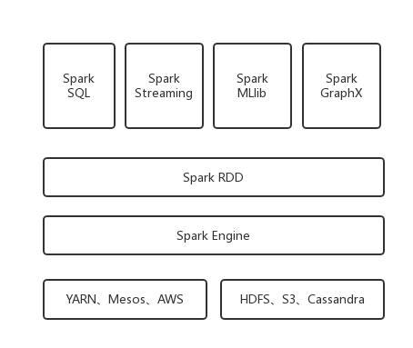

# Spark 简介

> Spark 的核心，其实就是一种新型的基于内存的大数据计算框架，可以基于Hadoop上存储的大数据进行计算（HDFS、HBase、Hive）。

> Spark 包含了大数据领域常见的各种计算框架： 
>
> - **Spark Core** ： 离线批处理（ MapReduce）
> - **Spark SQL** ：  交互式查询 （Hive）
> - **Spark Streaming** ：实时流计算（Storm）
> - **Spark MLlib** ： 机器学习 （Mahout）
> - **Spark GraphX** ： 图形计算

> Spark 主要用于大数据计算， Hadoop主要用于大数据存储（HDFS）、资源调度（YARN）。Spark + Hadoop 是未来大数据领域最热门的组合 。

