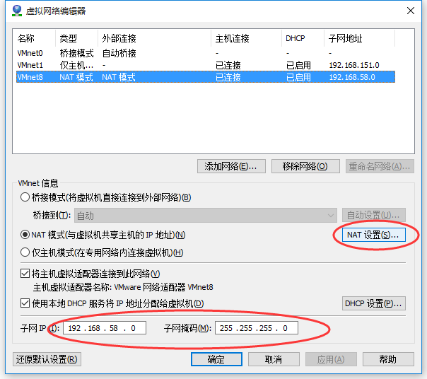
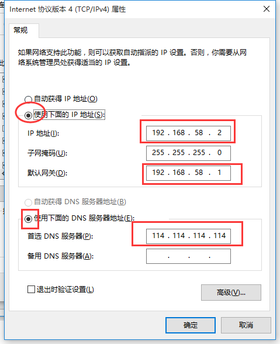
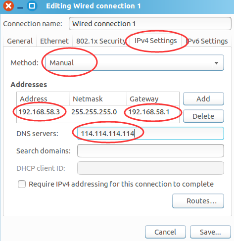

# 大数据平台环境配置

## 1. 环境描述

- VMware 14.1.2   &   Ubuntu Kylin 14.04
- JDK 1.8 
- Maven 3.5.4 (required: JDK1.7+)
- Eclipse eclipse-jee-luna-SR2 (required: JDK1.7+)
- Hadoop 2.5.2 (required: JDK 1.6+, Maven 3+)
- MySQL 5.6.x
- Hive 0.13.1
- Scala 2.12.8 (required: JDK1.8+)
- Spark 2.4.0 (required: JDK 1.8+, Maven 3.5.4)


## 2. VMware & Ubuntu

### 2.1 VMware 安装 Ubuntu 虚拟机

- 下载 Ubuntu 镜像并在 VMware 中进行安装

> VMware 14.1.2 
>
> ubuntukylin-14.04.1-desktop-amd64.iso

- 安装过程创建用户，并设置密码，默认拥有sudo权限，打开Ubuntu，可使用下面命令设置root密码：

```shell
$ sudo passwd root
```

- Ubuntu 虚拟机关闭防火墙， 可之际卸载防火墙

```shell
$ sudo apt-get remove iptables
```

- Ubuntu 安装SSH服务端

```shell
$ sudo apt-get install openssh-server
$ ps -e|grep ssh
  2334 ?        00:00:00 ssh-agent
  6472 ?        00:00:00 sshd
```

- 修改主机名和IP的映射关系

```shell
$ sudo vim /etc/hosts
    127.0.0.1    hadoop
```

- 配置ssh免登陆本地

```shell
$ ssh-keygen -t rsa
$ ssh-copy-id localhost
```

- 使用 Xshell 或者 SecureCRT 无法通过 SSH 连接 虚拟机

```shell
$ dpkg -l | grep ssh  # 查看是否安装了 ssh-server
$ sudo apt-get install openssh-server # 安装 ssh-server ，一般默认安装了 ssh-client
$ ps -e | grep ssh  # 查看ssh服务是否运行
$ sudo service ssh start # 启动ssh服务
$ vim /etc/ssh/sshd_config # 将 ‘PermitRootLogin without-password’ 注释，并添加 ‘PermitRootLogin yes’
$ sudo service ssh stop		# 重启
$ sudo service ssh start
```

### 2.2 配置虚拟机网络 NAT

- VMwanre工具栏找到 **编辑** ——》**虚拟网络编辑器**
- **更改设置**
- 选择 **VMnet8**， 配置子网IP和子网掩码



- 进入**NAT设置**，  配置网关（这里不能忽略，不然容易导致：虚拟机和宿主机能相互ping通，但是虚拟机不能连接外网）


- 宿主机 Windows 配置： **打开网络和共享中心** ——》 **更改适配器模式** ——》双击 **VMnet 网卡** ——》**属性** ——》**Internet 协议版本 4（TCP/IPv4）** ——》配置并确定



- 虚拟机 Ubuntu 配置：**Edit Connections** ——》**Add** ——》**Create** ——》配置 ——》**Save**




- 如果发现虚拟机不能ping通宿主机，但是宿主机可以ping通虚拟机，则需要：**控制面板** ——》 **系统和安全** ——》**Windows防火墙** ——》**高级设置** ——》**入站规则** ——》 启用 **文件和打印机共享（回显请求 ICMPv4-In 专用，共用）**


### 2.3  保存虚拟机快照

> 防止虚拟机在之后的调试过程中损坏，或者想恢复到最初环境，可以保存当前虚拟机快照

> 首先关闭虚拟机 --> 右键虚拟机 --> 拍摄快照

> 如果以后想回到这一刻的状态，可以 右键虚拟机 --> 恢复到快照...


## 3. JDK

-  下载 [jdk-8u201-linux-x64.tar.gz ](https://www.oracle.com/technetwork/java/javase/downloads/jdk8-downloads-2133151.html)
-  切换到 root 用户

```shell
$ su root
```

- 在 /usr 目录下新建目录 java

```shell
# cd /usr
# mkdir java
```

- 将jdk压缩包移动到java目录，并解压

```shell
# mv  jdk-8u201-linux-x64.tar.gz /usr/java
# tar -zxvf jdk-8u201-linux-x64.tar.gz
```

- 设置环境变量

```shell
# vi ~/.profile
    export JAVA_HOME=/usr/java/jdk1.8.0_201
    export PATH=$PATH:$JAVA_HOME/bin
# . ~/.profile
```

- 验证安装结果

```shell
# java -version
	java version "1.8.0_201"
	Java(TM) SE Runtime Environment (build 1.8.0_201-b09)
	Java HotSpot(TM) 64-Bit Server VM (build 25.201-b09, mixed mode)
```


## 4. Maven

> 要求 JDK 1.7 +

- 下载 [Maven3.5.4](http://www-eu.apache.org/dist/maven/maven-3/3.5.4/binaries/apache-maven-3.5.4-bin.tar.gz)
-  移动到 /usr/java/ 目录，并解压

```shell
# mv apache-maven-3.5.4-bin.tar.gz /usr/java
# tar -zxvf apache-maven-3.5.4
```

- 为了加快Maven构建速度，可以将已有的 .m2 拷贝到 /home/hadoop/.m2/ 目录
- 配置 maven 环境变量

```shell
$ vim ~/.profile
    export MAVEN_HOME=/usr/java/apache-maven-3.5.4
    export PATH=$PATH:$MAVEN_HOME/bin
$ . ~/.profile  
```

- 配置 Maven 国内镜像地址

```shell
$ sudo vim /usr/java/apache-maven-3.5.4/conf/settings.xml
<mirrors>
    <mirror>
      <id>alimaven</id>
      <name>aliyun maven</name>
      <url>http://maven.aliyun.com/nexus/content/groups/public/</url>
      <mirrorOf>central</mirrorOf>        
    </mirror>
</mirrors>
```

- Maven 常用命令

| 命令                                                 | 含义                         |
| ---------------------------------------------------- | ---------------------------- |
| mvn clean                                            | 清理编译结果                 |
| mvn compile [-Pnative]                               | 编译源代码                   |
| mvn test [-Pnative]                                  | 运行测试程序                 |
| mvn package                                          | 创建JAR包                    |
| mvn compile findbugs:findbugs                        | 运行findbugs                 |
| mvn compile checkstyle:checkstyle                    | 运行 checkstyle 检查编程规范 |
| mvn install                                          | 将JAR包放到M2缓存中          |
| mvn deploy                                           | 将 JAR 部署到 Maven 仓库中   |
| mvn package [-Pdist][-Pdocs][-Psrc][-Pnative][-Dtar] | 构建发布版                   |
| mvn version:set -Dnew Version=NEWVERSION             | 修改版本                     |


## 5. Eclipse

> 要求： JDK1.7+

- 下载  eclipse-jee-luna-SR2

```shell
# wget http://ftp.osuosl.org/pub/eclipse/technology/epp/downloads/release/luna/SR2/eclipse-jee-luna-SR2-linux-gtk-x86_64.tar.gz
```

- 创建 /usr/eclipse 目录， 并解压 eclipse

```shell
# cd /usr
# mkdir eclipse
# mv eclipse-jee-luna-SR2-linux-gtk-x86_64.tar.gz /usr/eclipse
# tar -zxvf eclipse-jee-luna-SR2-linux-gtk-x86_64.tar.gz
```

- #### 创建eclipse桌面快捷方式

```shell
# su hadoop
$ cd ~/Desktop
$ sudo touch eclipse.desktop
$ sudo vim eclipse.desktop 
    [Desktop Entry]
    Encoding=UTF-8
    Name=Eclipse
    Comment=Eclipse
    Exec=/usr/eclipse/eclipse/eclipse
    Icon=/usr/eclipse/eclipse/icon.xpm
    Terminal=false
    StartupNotify=true
    Type=Application
    Categories=Application;Development;    
# sudo chmod 775 eclipse.desktop
```

- Eclipse 启动出错，需要配置下面的步骤

```shell
# cd /usr/eclipse/eclipse
# mkdir jre
# cd jre
# ln -s /usr/java/jdk1.8.0_201
```

- 双击桌面 Eclipse 图标启动 Eclipse， 并选择 ~/workspace 为工作空间
- 设置Eclipse快捷键: Windows--> Preferences --> General --> Keys，找到 content asist 修改下边值 : Binding 改成 Alt+/ ; When 改为 Editing Text
- Ubuntu 系统快捷键会与 Eclipse 常用快捷键冲突，需要进入 System Settings --> Keyboad --> Shortcuts， 将冲突的快捷键修改成其他。
- eclipse 关联 maven：Windwos --> Preferences --> Maven --> Installation 选择 usr/java/apache-maven-3.5.4, 确认。


## 6. Hadoop 环境配置

> 要求： JDK1.7+

- 先下载 Hadoop 可执行文件,解压到/usr/hadoop目录

```shell
$ wget http://archive.apache.org/dist/hadoop/common/hadoop-2.5.2/hadoop-2.5.2.tar.gz
$ tar -zxvf hadoop-2.5.2.tar.gz -C /usr/hadoop
```

-  配置环境变量

```shell
export HADOOP_HOME=/usr/hadoop/hadoop-2.5.2
```


### 6.1 伪分布式配置

- 进入 $HADOOP_HOME/etc/hadoop

```shell
$ cd /usr/hadoop/hadoop-2.5.2/etc/hadoop
```

-  hadoop-env.sh

```shell
export JAVA_HOME=/usr/java/jdk1.8.0_201
```

- core-site.xml

```xml
        <property>
            <name>fs.default.name</name>
            <value>hdfs://hadoop:9000</value>
        </property>
        <property>
            <name>hadoop.tmp.dir</name>
            <value>/usr/hadoop/hadoop-2.5.2/tmp</value>
        </property>
```

- hdfs-site.xml

```xml
        <property>
            <name>dfs.replication</name>
            <value>1</value>
        </property>
```

- mapred-site.xml (`mv mapred-site.xml.template mapred-site.xml`)

```xml
        <property>
            <name>mapreduce.framework.name</name>
            <value>yarn</value>
        </property>
```

- yarn-site.xml

```xml
        <property>
            <name>yarn.resourcemanager.hostname</name>
            <value>hadoop</value>
        </property>
        <property>
            <name>yarn.nodemanager.aux-services</name>
            <value>mapreduce_shuffle</value>
        </property>
```

- 格式化hdfs

```shell
$ cd /usr/hadoop/hadoop-2.5.2
$ bin/hdfs namenode -format (hadoop namenode -format)
```

- 启动hdfs

```shell
$ sbin/start-dfs.sh
```

- 启动yarn

```shell
$ sbin/start-yarn.sh
```

- 查看守护进程

```shell
$ jps
        27408 NameNode
        28218 Jps
        27643 SecondaryNameNode
        28066 NodeManager
        27803 ResourceManager
        27512 DataNode
```

- 通过浏览器查看

> http://192.168.8.118:50070 （HDFS管理界面，可能需要配置Windows的本地dns   C:\Windows\System32\drivers\etc）
> http://192.168.8.118:8088 （yarn MR管理界面）

### 6.2 分布式配置

> 暂时使用伪分布式学习足够了。


## 7.  Hadoop 源码阅读及编译环境搭建

> 要求： JDK 1.7+, Maven 3+， Eclipse

### 7.1 安装 C 相关编译工具

> gcc、g++、libtool、automake、autoconf

- g++ 一定要安装

```shell
$ sudo apt-get install gcc
$ gcc --version
$ sudo apt-get install g++
$ g++ --version
$ sudo apt-get install libtool
$ libtool --version
$ sudo apt-get install automake
$ automake --version
$ sudo apt-get install autoconf
$ autoconf --version
```

- 安装四个库：zlib(zlib1g) zlib-devel(zlib1g-dev) openssl openssl-devel(libssl-dev)

```shell
$ sudo apt-get install zlib1g
$ sudo apt-get install zlib1g-dev
$ sudo apt-get install openssl
$ sudo apt-get install libssl-dev
```

- 安装 cmake 

```shell
$ sudo apt-get install cmake
```

### 7.2 安装 protobuf

- 需要先检查自己的hadoop编译时的版本

```shell
# /usr/hadoop/hadoop-2.5.2/bin/hadoop version
Hadoop 2.5.2
Subversion https://git-wip-us.apache.org/repos/asf/hadoop.git -r cc72e9b000545b86b75a61f4835eb86d57bfafc0
Compiled by jenkins on 2014-11-14T23:45Z
Compiled with protoc 2.5.0
From source with checksum df7537a4faa4658983d397abf4514320
This command was run using /usr/hadoop/hadoop-2.5.2/share/hadoop/common/hadoop-common-2.5.2.jar
hadoop@ubuntu:/usr/hadoop/hadoop-2.5.2/bin$ pwd
/usr/hadoop/hadoop-2.5.2/bin
```

- 去下载对应版本的 protobuf

```
https://github.com/google/protobuf/tags
```

- 在 /usr/hadoop 目录下解压

```shell
$ unzip protobuf-2.5.0.zip
```

- 依次执行下面命令（前提必须已经安装了 g++ ）

```shell
$ cd /usr/hadoop/protobuf-2.5.0
$ ./configure
$ make
$ make check
$ sudo make install 
$ which protoc
```

- 执行完成上面命令，protoBuf 默认安装在 /usr/local/bin/ 目录下
- 检测是否安装成功，若显示error, 则需要添加下面的环境变量: **坑,要注意！！！**

```shell
$ protoc --version
    protoc: error while loading shared libraries: libprotoc.so.8: cannot open shared object file: No such file or directory
```

```shell
$ vim ~/.profile
    export LD_LIBRARY_PATH=/usr/local/lib
$ . ~/.profile
```

- 检测是否安装成功

```shell
$ protoc --version
    libprotoc 2.5.0
```

### 7.3 安装 findbugs

- 下载对应版本的 findbugs

```shell
$ wget https://versaweb.dl.sourceforge.net/project/findbugs/findbugs/3.0.1/findbugs-3.0.1.tar.gz
```

- 解压到 /usr/hadoop/ 目录

```shell
$ tar -zxvf findbugs-3.0.1.tar.gz -C /usr/hadoop/
```

- 添加环境变量

```shell
$ vim ~/.profile
    export $FINDBUGS_HOME=/usr/hadoop/findbugs-3.0.1
    export $PATH=$PATH:$FINDBUGS_HOME/bin
$ which fb
```

### 7.4 编译 Hadooop 源码

- 下载源码 （要与之前搭建的Hadoop运行环境版本一致）

```shell
$ cd ~/workspace
$ wget http://archive.apache.org/dist/hadoop/common/hadoop-2.5.2/hadoop-2.5.2-src.tar.gz
```

- 解压 Hadoop 源码

```shell
$ tar -zxvf  hadoop-2.5.2-src.tar.gz
```

- 通过 **BUILDING.txt** 文件可以查看mvn编译hadoop的各种参数：

```shell
$ vim ~/workspace/hadoop-2.5.2-src/BUILDING.txt 
```

- 编译JAR包、native code并生成文档

```shell
$ cd ~/workspace/hadoop-2.5.2-src
$ mvn package -Pdist,native,docs -DskipTests -Dtar
[INFO] BUILD SUCCESS
[INFO] ------------------------------------------------------------------------
[INFO] Total time: 56:43 min
[INFO] Finished at: 2018-08-09T13:55:14+08:00
[INFO] Final Memory: 100M/375M
```

- 编译的native包在下面路径中：

```shell
hadoop/hadoop-dist/target/hadoop-2.5.2/lib/native
```

- 每个子模块编译后生成的JAR包放到了与源代码目录平级的target目录中
- 相关问题

> 问题一：MojoExecutionException 异常 （Failed to execute goal org.apache.hadoop:hadoop-maven-plugins:2.5.2:protoc (compile-protoc) on project hadoop-common: org.apache.maven.plugin.MojoExecutionException: protoc failure）
>
> > protoc 没有安装成功，很有可能没有配置 **LD_LIBRARY_PATH** 环境变量.
>
> 问题二：找不到 pom 文件
>
> > 需要配置 Maven 国内镜像
> > ```shell
> > $ sudo vim /usr/java/apache-maven-3.5.4/conf/settings.xml
> > <mirrors>
> >     <mirror>
> >         <id>alimaven</id>
> >         <name>aliyun maven</name>
> >         <url>http://maven.aliyun.com/nexus/content/groups/public/</url>
> >         <mirrorOf>central</mirrorOf>
> >     </mirror>
> >     <mirror>
> >         <id>CN</id>
> >         <name>OSChina Central</name>
> >         <url>http://maven.oschina.net/content/groups/public/</url>
> >         <mirrorOf>central</mirrorOf>
> >     </mirror>
> >  </mirrors>
> > ```


### 7.5 编译单个模块

> 如果修改了某个模块的代码，可编译后，将对应的JAR包覆盖到 ${HADOOP_HOME}/share/hadoop 目录中对应的 JAR 包上。如果只编译某一个子模块，需要将模块依赖的JAR包作为它的第三方库引入。需要执行下面的命令，然后再进入对应的子模块进行编译。

```shell
$ cd /workspace/hadoop/
$ mvn install -DskipTests
```

### 7.6 编译安装压缩工具snappy到hadoop

- 下载并安装 [snappy](https://github.com/google/snappy/releases)，选择 1.1.4 版本，否则需要通过 cmake 安装

```shell
$ wget https://github.com/google/snappy/archive/1.1.4.tar.gz
$ tar -zxvf 1.1.4.tar.gz
$ cd snappy-1.1.4
$ ./autogen.sh
$ ./configure
$ make
$ sudo make install
$ ls -lh /usr/local/lib | grep snappy
-rw-r--r-- 1 root root  551K Nov 21 20:00 libsnappy.a
-rwxr-xr-x 1 root root   955 Nov 21 20:00 libsnappy.la
lrwxrwxrwx 1 root root    18 Nov 21 20:00 libsnappy.so -> libsnappy.so.1.3.1
lrwxrwxrwx 1 root root    18 Nov 21 20:00 libsnappy.so.1 -> libsnappy.so.1.3.1
-rwxr-xr-x 1 root root  266K Nov 21 20:00 libsnappy.so.1.3.1
```

- 重新编译Hadoop源码

```shell
$ mvn package -Pdist,native -DskipTests -Drequire.snappy
$ mvn package -DskipTests -Pdist,native -Dtar -Dsnappy.lib=/usr/local/lib -Dbundle.snappy   
```

- 检测 Hadoop 的 native

```shell
$ HADOOP_HOME/bin/hadoop checknative
Native library checking:
hadoop: true /usr/hadoop/hadoop-2.5.2/lib/native/libhadoop.so.1.0.0
zlib:   true /lib/x86_64-linux-gnu/libz.so.1
snappy: true /usr/local/lib/libsnappy.so.1
lz4:    true revision:99
bzip2:  false
```

### 7.7  Eclipse 阅读 Hadoop 源码

- 安装 Eclipse
- 在用eclipse导入hadoop源码之前，需要进行下面的步骤。 **注意**：执行命令前确保源文件没有先被导入到eclipse中，因为"mvn eclipse:eclipse -DskipTests"命令会生成eclipse的配置文件，如果先被eclipse打开过，这些配置文件就没发生成了。

```shell
$ cd /home/hadoop/workspace/hadoop/hadoop-maven-plugins
$ mvn install
$ cd /home/hadoop/workspace/hadoop
$ mvn eclipse:eclipse -DskipTests
```

- 构建成功之后，就可以打开eclipse，并以maven项目导入hadoop源码：依次选择 File --> Import --> Maven --> Existing Maven Project。 然后选择hadoop源码目录：/home/hadoop/workspace/hadoop
- 相关问题：

> 问题一：  加载某个pom卡住
>
> > 1. 在 .m2 目录下找到对应pom目录，并删除;
> > 2. 然后在eclipse中update maven。
>
> 问题二： hadoop-streaming 中build path 错误
>
> > 1. 右键 hadoop-streaming 项目
> > 2. Build Path --> Configure Build Path --> Source
> > 3. Remove ...hadoop-yarn-server-resourcemanager/conf
> > 4. Link Source， 选择 源码根目录/hadoop-yarn-project/hadoop-yarn/hadoop-yarn-server/hadoop-yarn-server-resourcemanager/conf，
> > 5. inclusion patterns：capacity-scheduler.xml；exclusion patters：**/*.java 
>
> 问题三：maven-resources-plugin prior to 2.4 is not supported by m2e. Use maven-resources-plugin version 2.4 or later.
>
> > 当前使用的版本2.2过低，只要使用高版本的maven-resources-plugin就可以解决问题。打开项目hadoop-project的pom.xml文件，修改如下：
> >
> > <plugin>
> >   <groupId>org.apache.maven.plugins</groupId>
> >   <artifactId>maven-resources-plugin</artifactId>
> >   <version>2.5</version>
> > </plugin>
>
> 问题四：Plugin execution not covered by lifecycle configuration: org.apache.avro:avro-maven-plugin:1.7.4:protocol (execution: default, phase: generate-sources)
>
> > 打开Properties面板，Maven->Lifecycle-Mapping，右侧点击open workspace lifecycle mapping metadata，添加如下内容：
> >
> > ```xml
> > <pluginExecution>
> >             <pluginExecutionFilter>
> >                 <groupId>org.apache.maven.plugins</groupId>
> >                 <artifactId>maven-antrun-plugin</artifactId>
> >                 <goals>
> >                     <goal>run</goal>
> >                 </goals>
> >                 <versionRange>[1.7,)</versionRange>
> >             </pluginExecutionFilter>
> >             <action>
> >                 <ignore />
> >             </action>
> >         </pluginExecution>
> >         <pluginExecution>
> >             <pluginExecutionFilter>
> >                 <groupId>org.apache.maven.plugins</groupId>
> >                 <artifactId>maven-jar-plugin</artifactId>
> >                 <goals>
> >                     <goal>test-jar</goal>
> >                     <goal>jar</goal>
> >                 </goals>
> >                 <versionRange>2.3.1</versionRange>
> >             </pluginExecutionFilter>
> >             <action>
> >                 <ignore />
> >             </action>
> >         </pluginExecution>
> >          <pluginExecution>
> >             <pluginExecutionFilter>
> >                 <groupId>org.apache.avro</groupId>
> >                 <artifactId>avro-maven-plugin</artifactId>
> >                 <goals>
> >                     <goal>schema</goal>
> >                     <goal>protocol</goal>
> >                 </goals>
> >                 <versionRange>[1.7.4,)</versionRange>
> >             </pluginExecutionFilter>
> >             <action>
> >                 <ignore />
> >             </action>
> >         </pluginExecution>
> >          <pluginExecution>
> >             <pluginExecutionFilter>
> >                 <groupId>org.apache.hadoop</groupId>
> >                 <artifactId>hadoop-maven-plugins</artifactId>
> >                 <goals>
> >                     <goal>version-info</goal>
> >                     <goal>protoc</goal>
> >                 </goals>
> >                 <versionRange>[2.5.2,)</versionRange>
> >             </pluginExecutionFilter>
> >             <action>
> >                 <ignore />
> >             </action>
> >         </pluginExecution> 
> >          <pluginExecution>
> >             <pluginExecutionFilter>
> >                 <groupId>org.codehaus.mojo.jspc</groupId>
> >                 <artifactId>jspc-maven-plugin</artifactId>
> >                 <goals>
> >                     <goal>compile</goal>
> >                 </goals>
> >                 <versionRange>2.0-alpha-3</versionRange>
> >             </pluginExecutionFilter>
> >             <action>
> >                 <ignore />
> >             </action>
> >         </pluginExecution> 
> > 		<pluginExecution>
> >             <pluginExecutionFilter>
> >                 <groupId>org.codehaus.mojo</groupId>
> >                 <artifactId>build-helper-maven-plugin</artifactId>
> >                 <goals>
> >                     <goal>add-source</goal>
> >                 </goals>
> >                 <versionRange>1.5</versionRange>
> >             </pluginExecutionFilter>
> >             <action>
> >                 <ignore />
> >             </action>
> >         </pluginExecution> 
> > 		<pluginExecution>
> >             <pluginExecutionFilter>
> >                 <groupId>org.apache.maven.plugins</groupId>
> >                 <artifactId>maven-plugin-plugin</artifactId>
> >                 <goals>
> >                     <goal>descriptor</goal>
> >                 </goals>
> >                 <versionRange>3.0</versionRange>
> >             </pluginExecutionFilter>
> >             <action>
> >                 <ignore />
> >             </action>
> >         </pluginExecution> 
> > ```
> >
> > 保存后点击reload workspace lifecycle mapping metadata，然后对所有项目执行maven-update project。其他类似的报错同上解决方法，添加对应的groupId，artifactId，goals，versionRange，例如：
> >
> > >  如下错误提示信息，
> > >  groupid：org.apache.avro
> > >  artifactId：avro-maven-plugin
> > >  goals：schema
> > >  versionRange：[1.7.6-cdh5.11.0,)
> > >  org.apache.avro:avro-maven-plugin:1.7.6-cdh5.11.0:schema (execution: generate-avro-test-sources, phase: generate-test-sources)
> >
>
> 问题五：org.apache.hadoop.io.serializer.avro.TestAvroSerialization 显示找不到 AvroRecord
>
> > 下载 [avro-tools-1.7.4.jar](http://archive.apache.org/dist/avro/avro-1.7.4/java/avro-tools-1.7.4.jar)
> >
> > 进入目录：源码根目录\hadoop-common-project\hadoop-common\src\test\avro
> >
> > ```shell
> > $ java -jar path/to/avro-tools-1.7.4.jar compile schema avroRecord.avsc ../java
> > ```
> >
> > eclipse 刷新
>
> 问题六： hadoop-common 中显示有些类没有
>
> > 进入目录：源码根目录\hadoop-common-project\hadoop-common\src\test\proto
> >
> > ```shell
> > $ protoc --java_out=../java *.proto
> > ```
> >
> > eclipse 刷新
>
> 问题七： JSP、HTML 错误
>
> > 进入 Preference --> Validation, 取消相关选项的勾

### 7.8  Hadoop 源码组织结构

> 比较重要的目录有四个
>
> > - **hadoop-common-project** : Hadoop 基础库所在目录，包含了其他所有模块可能会用到的基础库，如 RPC、Metrics、Counter。
> > - **hadoop-mapreduce-project** ：MapReduce 框架的实现，在MRv1中，MapReduce 由编程模型（map/reduce）、调度系统（JobTrack 和 TaskTrack）和数据处理引擎（MapTask和ReduceTask）等模块组成，而 Hadoop 2.x 中的资源调度功能由新增的 YARN 完成 （编程模型和数据处理引擎不变）。
> > - **hadoop-hdfs-project** ： Hadoop 分布式文件系统实现，支持多NameNode，同时解决了NameNode 单点故障的问题。
> > - **hadoop-yarn-project** ： Hadoop 资源管理系统 YARN 实现。
>

> 阅读技巧：
>
> > 1. 首先，需要弄清楚hadoop的代码模块，知道client，master，slave各自对应的模块（hadoop中核心系统都是master/slave架构，非常类似），并在阅读源代码过程中，时刻谨记你当前阅读的代码属于哪一个模块，会在哪个组件中执行；
> > 2. 之后需要弄清楚各个组件的交互协议，也就是分布式中的RPC，这是hadoop自己实现的，需要对hadoop RPC的使用方式有所了解，然后看各模块间的RPC protocol，到此，则把握了系统的骨架，这是接下来阅读源代码的基础；
> > 3. 接着，要选择一个模块开始阅读，一般会先选择Client，这个模块相对简单些，会给自己增加信心，为了在阅读代码过程中，不至于迷失自己，建议在纸上画出类的调用关系，边看边画。

### 7.9 源码修改测试

- 通过Eclipse 在工程 **hadoop-hdfs-project** 中的 **hadoop-hdfs** 中找到源文件 **NameNode.java**（在包**org.apache.hadoop.hdfs.server.namenode** 内）
- 在main 函数内添加以下代码

```java
System.out.println("Hello hadoop!!!!!!!!!");
System.out.println("Hello hadoop!!!!!!!!!");
System.out.println("Hello hadoop!!!!!!!!!");
System.out.println("Hello hadoop!!!!!!!!!");
```

-  进入源文件根目录，重新编译整个项目 (也可以单独编译一个子项目)

```shell
$ cd ~/workspace/hadoop
$ mvn clean
$ mvn -Pdist -DskipTests -Dtar
```

- 执行完成以后我们可以在目录 **hadoop-hdfs-project/hadoop-hdfs/target** 下找到文件 **hadoop-hdfs-2.5.2.jar**， 这就是我们刚生成的jar包，我们将hadoop程序中的 **hadoop-hdfs-2.5.2.jar **替换成编译后的jar包（在 **$JAVA_HOME/share/hadoop/hdfs** 下）。

- 接下来重新启动hadoop，我们观察其中启动的时候是否会执行我们的 `System.out.println(“hello hadoop!!!!!!”)`语句。

```shell
$ stop-hdfs.sh  #先关闭hdfs
$ start-hdfs.sh #再启动hdfs	
```

- 我们可以看到在启动的过程中控台打印出了

```shell
localhost: Hello hadoop!!!!!!!!!
localhost: Hello hadoop!!!!!!!!!
```

- 修改源码成功。 参考链接： [源码修改测试](https://blog.csdn.net/alphags/article/details/53350150)

### 7.10 利用 Eclipse 进行远程调试

> 以调试 NameNode 为例

- 调试模式下启动 Hadoop 
- 在 $HADOOP_HOME/bin/hdfs 脚本中找到下面部分：

```shell
if [ "$COMMAND" = "namenode" ] ; then
  CLASS='org.apache.hadoop.hdfs.server.namenode.NameNode'
  HADOOP_OPTS="$HADOOP_OPTS $HADOOP_NAMENODE_OPTS"
```

- 修改为

```shell
if [ "$COMMAND" = "namenode" ] ; then
  CLASS='org.apache.hadoop.hdfs.server.namenode.NameNode'
  HADOOP_OPTS="$HADOOP_OPTS $HADOOP_NAMENODE_OPTS -agentlib:jdwp=transport=dt_socket,server=y,address=8888,suspend=y"
```

- 如果要调试其他部分，也可以按照这个原理去添加:

```shell
-agentlib:jdwp=transport=dt_socket,server=y,address=8888,suspend=y
```

- 运行了脚本后会看到Shell命令行终端显示如下信息：

```shell
$ sbin/start-dfs.sh
    hadoop: Listening for transport dt_socket at address: 8888
```

- 此时表明 NameNode 处于监听状态，直到收到debug确认信息
- 在Eclipse中调试Hadoop程序

- 在 Eclispe 菜单栏中，依次选择 Run --> Debug Configuration --> Remote Java Application --> New。 并按照要求填写远程调试器名称， NameNode 所在 host 以及监听端口号等信息，并选择 hadoop-hdfs 源代码工程，便可进入调试模式。
- 参考 [Hadoop学习之配置Eclipse远程调试Hadoop](https://blog.csdn.net/skywalker_only/article/details/25539115)

### 7.11 其他

- 注意： 配置完成之后保存虚拟机快照

- 相关链接

  > [Eclipse导入Hadoop源码](https://blog.csdn.net/StormrageWang/article/details/50777651)
  >
  > [Eclipse 导入 Hadoop 源码 错误处理](http://www.cnblogs.com/errorx/p/3779578.html)
  >
  > [Hadoop源码本机编译](https://blog.csdn.net/stormragewang/article/details/50291223)
  >
  > [各种报错解决办法](http://zhouleihao.com/2017/07/20/eclipse-hadoop-source-code/)


## 8. MySQL

- Ubuntu 安装Mysql，并配置 root 密码

```shell
$ sudo apt-get install mysql-server
$ sudo apt-get install mysql-client
$ sudo apt-get install libmysqlclient-dev  
```

- 检测是否安装成功

```shell
$ sudo netstat -tap | grep mysql
tcp 0 0 localhost:mysql *:* LISTEN 8793/mysqld
```

- 进入 mysql 命令行

```shell
$ mysql -u root -p
```

- 设置 mysql 允许远程访问

```shell
$ sudo vim /etc/mysql/mysql.cnf
// 注释 bind-address = 127.0.0.1
```

- 进入mysql 命令行，执行授权命令

```mysql
grant all on *.* to root@'%' identified by 'password' with grant option;
flush privileges;
```

- 退出 mysql 命令行，重启 Mysql

```shell
$ sudo service mysql restart
```


## 9. Hive

> 要求： JDK1.7+， Mysql 5.4.x+， Hadoop 2.2.x +

- 下载 [Hive0.13.1](http://archive.apache.org/dist/hive/hive-0.13.1/apache-hive-0.13.1-bin.tar.gz)

```shell
$ wget http://archive.apache.org/dist/hive/hive-0.13.1/apache-hive-0.13.1-bin.tar.gz
$ mv apache-hive-0.13.1-bin.tar.gz /usr/hadoop/
$ cd /usr/hadoop/
$ tar -zxvf apache-hive-0.13.1-bin.tar.gz
```

- 配置 HADOOP_HOME 环境变量（Hive 运行的时候会根据这个环境变量找到 Hadoop 的相关配置参数）
- 启动 HDFS 和 YARN，并在 HDFS 上创建相关目录：

```shell
$ $HADOOP_HOME/bin/hadoop fs -mkdir /tmp
$ $HADOOP_HOME/bin/hadoop fs -mkdir -p /user/hive/warehouse
$ $HADOOP_HOME/bin/hadoop fs -chmod g+w /tmp
$ $HADOOP_HOME/bin/hadoop fs -chmod g+w /user/hive/warehouse
```

- 因为hive内置的存储元数据的数据库不支持并发操作，所以在实际生产环境中，会使用 mysql 等其他数据库，首先需要下载 **mysql-connector-java-5.1.27-bin.jar** 并放到 **HIVE_HOME/lib/** 目录下

```shell
$ wget https://cdn.mysql.com//Downloads/Connector-J/mysql-connector-java-5.1.47.tar.gz
$ tar -zxvf mysql-connector-java-5.1.47.tar.gz
$ cd mysql-connector-java-5.1.47
$ cp mysql-connector-java-5.1.47-bin.jar $HIVE_HOME/lib/
```

- 在 HIVE_HOME/conf/hive-env.sh 中添加：

```shell
$ cp hive-env.sh.template hive-env.sh
$ vim hive-env.sh
```

```shell
export JAVA_HOME=/usr/java/jdk1.8.0_201
export HADOOP_HOME=/usr/hadoop/hadoop-2.5.2
export HIVE_HOME=/usr/hadoop/apache-hive-0.13.1-bin
export HIVE_CONF_DIR=/usr/hadoop/apache-hive-0.13.1-bin/conf
```

- 在 **HIVE_HOME/conf/hive-site.xml ** 中先将所有 **property** 项删除，然后再增加下面配置:

```shell
$ cp hive-default.xml.template hive-site.xml 
$ vim hive-site.xml
```

```xml
    <property>
		<name>javax.jdo.option.ConnectionURL</name>
		<value>jdbc:mysql://hadoop:3306/hive?createDatabaseIfNotExist=true</value>
		<description>JDBC connect string for a JDBC metastore</description>
	</property>
	<property>
		<name>javax.jdo.option.ConnectionDriverName</name>
		<value>com.mysql.jdbc.Driver</value>
		<description>Driver class name for a JDBC metastore</description>
	</property>
	<property>
		<name>javax.jdo.option.ConnectionUserName</name>
		<value>root</value>
		<description>username to use against metastore database</description>
	</property>
	<property>
		<name>javax.jdo.option.ConnectionPassword</name>
		<value>1</value>
		<description>password to use against metastore database</description>
	</property>
	<property>
		<name>hive.cli.print.current.db</name>
		<value>true</value>
		<description>Whether to include the current database in the Hive prompt.</description>
	</property>
```

- 运行 `$HIVE_HOME/bin/hive` ，进入 Hive CLI 命令行
- **注意**： 如果运行 hive 出现异常（hive-log4j2.properties Async: true  org/apache/hadoop/crypto/key/KeyProvider）， 可能是因为 Hive 与 Hadoop版本不兼容导致的。

## 10. Scala

> 要求 JDK 1.8+

- 下载并解压   [Scala-2.12.8.tgz](https://downloads.lightbend.com/scala/2.12.8/scala-2.12.8.tgz)

```shell
$ cd /usr/hadoop
$ wget https://downloads.lightbend.com/scala/2.12.8/scala-2.12.8.tgz
$ tar -zxvf scala-2.12.8.tgz
```

- 配置环境变量

```shell
$ vim ~/.profile
	export SCALA_HOME=/usr/hadoop/scala-2.12.8
	export PATH=$PATH:$SCALA_HOME/bin
$ . ~/.profile
```

- 进入 Scala 命令行

```shell
$ scala
scala> 
```


## 11. Spark

